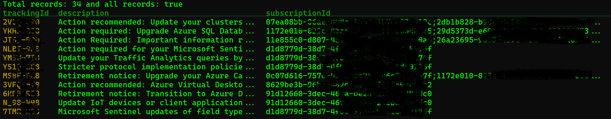

# Azure Health Advisory - Announcements[Retainments]

Azure Service Health - is a free service that provides personalized alerts and guidance when Azure service issues affect you. It can notify you, help you understand the impact of issues, and keep you updated as the issue resolves. It can also help you prepare for planned maintenance and changes that could affect the availability of your resources.

Visit [Azure Service Health](https://aka.ms/AzureServiceHealth 'Azure Service Health') to set up your alerts

Programmatically two methods to get service retirements:

* Azure Service Health
* Using RSS feed for Azure Updates – [RSS feed](https://azure.microsoft.com/en-us/updates/?updateType=retirements) currently provides most of updates, but Azure Service Health will include more target and direct announcements for services used by your solution.

**Note**
Recommendation is that customers to leverage Azure Service Health which provides details on services that customers is using today, but also review RSS feed which will include more services.

___
&nbsp;
&nbsp;
&nbsp;

Azure Service Health | Azure Updates (RSS) |
--- | --- |
Personalize to your subscription(s) | All announcements related to retirements |
More granular | No very easy to consume |
Ability to use using APIs _the category “action required or Retirement notice”_| Need manual review your services |

&nbsp;
&nbsp;

```kql
ServiceHealthResources
| where type =~ 'Microsoft.ResourceHealth/events'
| extend eventType = properties.EventType, status = properties.Status, description = properties.Title, trackingId = properties.TrackingId, summary = properties.Summary, priority = properties.Priority, impactStartTime = properties.ImpactStartTime, impactMitigationTime = todatetime(tolong(properties.ImpactMitigationTime))
| where eventType == 'HealthAdvisory’
```

&nbsp;
&nbsp;

Service Health Documentation: https://aka.ms/servicehealth-docs  
Service Health Webpage: https://aka.ms/ash-acom

&nbsp;

Azure Resource Graph docs:
- https://aka.ms/resource-graph/learntoquery
- https://learn.microsoft.com/en-us/azure/governance/resource-graph/samples/samples-by-table?tabs=azure-cli#servicehealthresources

Sample in [Go](https://learn.microsoft.com/en-us/azure/developer/go/ 'Azure for Go developers') in the folder [azurergm](azurergm)

Results:


Azure Advisory API sample in Go [azureav](azureav)
