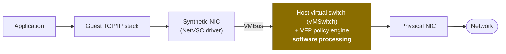
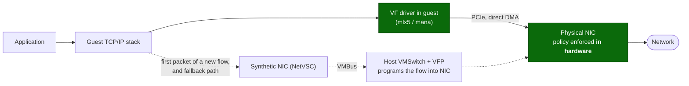
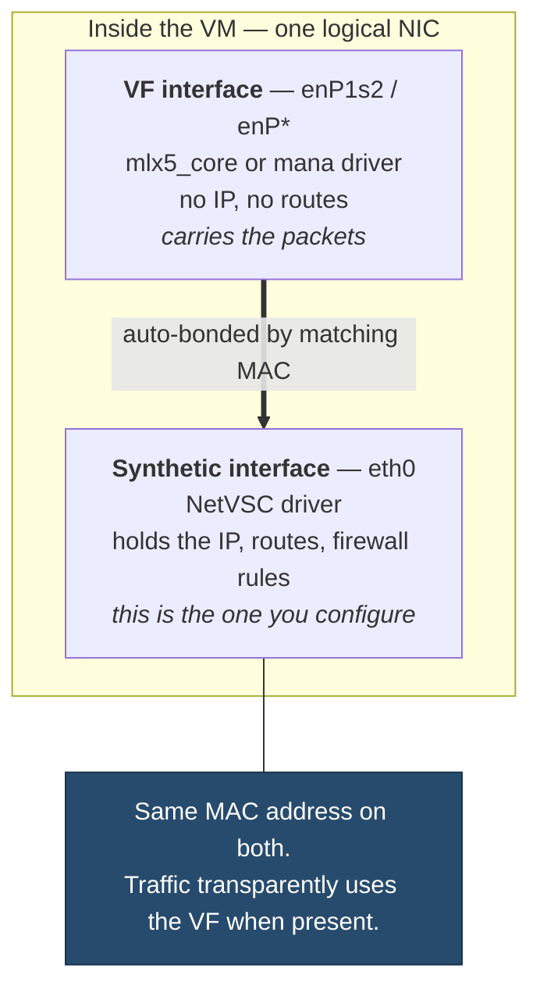
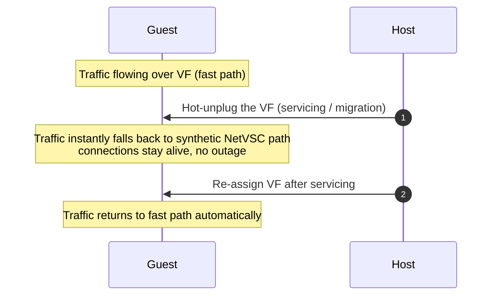
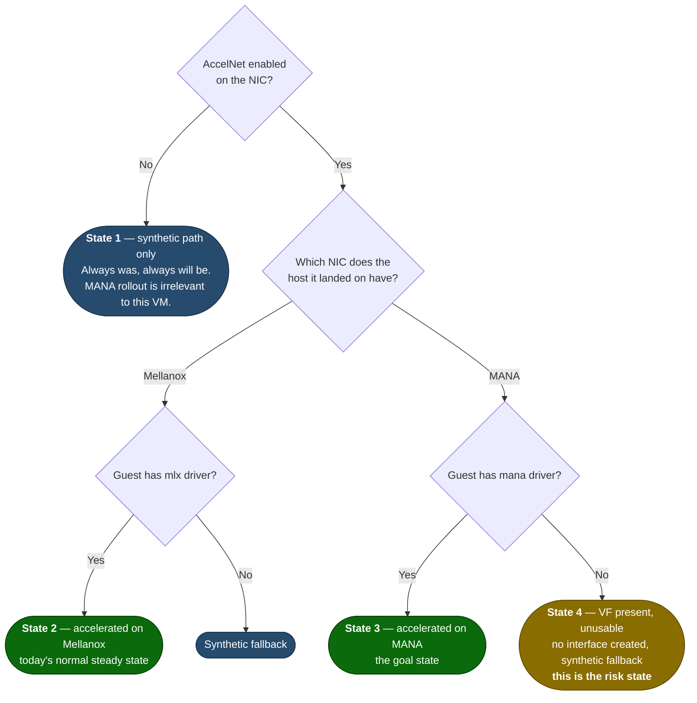

# How Accelerated Networking, VFs, Mellanox, and MANA actually work

A conceptual primer. Most MANA confusion isn't about MANA at all — it's that the **SR-IOV / Virtual Function model
behind Accelerated Networking was never well understood**, so people can't reason about what changes when the NIC
underneath swaps from Mellanox to MANA.

Read this before the [brief](./MANA-Existing-VM-SKUs-Brief.md) if terms like *VF*, *synthetic NIC*, or *NetVSC* aren't
already second nature.

---

## 1. Glossary — the five terms that matter

| Term | What it is |
|------|-----------|
| **Synthetic NIC** | The virtual network adapter Hyper-V always presents to the VM. Driven by the **NetVSC** driver. This is `eth0` on Linux / "Microsoft Hyper-V Network Adapter" on Windows. It **always exists**, on every Azure VM, AccelNet or not. |
| **SR-IOV** | *Single Root I/O Virtualization.* A PCIe standard that lets one physical NIC present itself as many independent, lightweight PCIe devices that can be assigned directly to VMs. |
| **VF (Virtual Function)** | One of those lightweight PCIe devices. Assigning a VF to a VM lets the guest talk to the physical NIC **directly**, bypassing the host's software switch. |
| **AccelNet** | Azure's name for "give this VM a VF." It is a **control-plane flag** on the NIC resource (`enableAcceleratedNetworking`). |
| **MANA / Mellanox** | Two different **physical NIC families** that provide the VF. Mellanox ConnectX-3/4Lx/5 (drivers `mlx4`/`mlx5`) is the current generation; MANA is Microsoft's own SmartNIC (driver `mana`). |

The single most important consequence of this list:

> **AccelNet is a request for a VF. It says nothing about which NIC hardware will provide that VF, or whether your
> guest has the driver for it.**

---

## 2. Why AccelNet exists — the data path without it

Without AccelNet, every packet is handled in **software on the host**:



Every packet crosses VMBus into the host, gets NSG rules, load-balancer rewrites, VNET encapsulation, and routing
applied **in host CPU**, then goes to the wire. That costs host CPU, adds latency, and — critically — adds **jitter**,
because the packet's fate depends on host scheduling.

---

## 3. The data path with AccelNet — and what a VF really does

With AccelNet, a **VF is assigned to the VM as a real PCIe device**. The guest driver talks to NIC hardware directly:



The policy is not skipped — it is **offloaded**. The host's VFP policy engine evaluates the **first packet of a new
flow**, then programs that flow's actions into the NIC's flow table. Every subsequent packet of that flow is handled
entirely in NIC hardware. Same NSGs, same load balancing, same VNET rules — just enforced in silicon.

**This is why "number of concurrent connections" keeps appearing in MANA guidance.** Flow-heavy workloads (NVAs,
proxies, load balancers, high-fan-out services) live or die by that hardware flow table. A workload with a handful of
long-lived flows barely notices losing the VF; a workload creating thousands of short-lived flows notices immediately.

---

## 4. The two-interface model — the part everyone trips over

An AccelNet-enabled vNIC shows up in the guest as **two interfaces, not one**:



Rules that follow from this:

- **Always configure the synthetic interface.** IP, routes, MTU, firewall — all on `eth0`. The VF is a transport
  detail. Configuring the VF directly, or adding it to your own bond, breaks things.
- **Both interfaces having the same MAC is correct**, not a misconfiguration. Monitoring tools that alarm on duplicate
  MACs are wrong here.
- **Counters can look strange.** On Linux, most traffic bytes appear on the VF interface while the IP lives on `eth0`.
  Monitoring that only reads `eth0` may under-report throughput.
- **Windows hides this.** You normally see one adapter; the VF is bound underneath. On MANA hardware, the VF surfaces
  as `Microsoft Azure Network Adapter` in `Get-NetAdapter`.

### Why the synthetic path never goes away

This is the design's whole point. The VF can be **revoked at any time** — host maintenance, live migration, NIC
firmware update:



**The synthetic path is the permanent failsafe.** Which is exactly why a VM with no MANA driver still has full
connectivity on MANA hardware — it simply stays on the failsafe path forever instead of momentarily.

---

## 5. Mellanox vs. MANA — what actually differs

Both provide a VF. Both sit behind the same AccelNet flag. The guest-visible differences:

| | Mellanox (current gen) | MANA (new gen) |
|---|---|---|
| Hardware | ConnectX-3 / 4 Lx / 5 | Microsoft Azure Network Adapter |
| PCI vendor ID | `15b3` | `1414` (Microsoft), device `00ba` |
| Linux driver | `mlx4_core` / `mlx5_core` | `mana` (kernel 5.15+; 6.2+ adds RDMA + DPDK) |
| Windows driver | Mellanox VPI / inbox | `Microsoft Azure Network Adapter` |
| VFs per VM | **One VF per vNIC** | **One VF shared by all vNICs** |
| NIC firmware update | Disruptive enough to require VF revoke | Sub-second |
| Extras | — | Azure Boost data-path offload, higher throughput, lower latency |

Two practical notes:

- **One VF for all vNICs (MANA) is not a downgrade.** Azure's networking limits are set **per VM size**, never per VF.
  A multi-NIC VM sees fewer PCI devices and the same performance ceiling.
- **Keep `mlx` support installed.** MANA-eligible series run on *both* hardware generations during rollout. An image
  should carry `mlx5` **and** `mana` so it accelerates wherever it lands. Removing Mellanox support to "clean up" is a
  self-inflicted outage of the fast path.

---

## 6. Putting it together — the four states a VM can be in



**State 2 → State 4 is the entire risk of this change.** A VM sitting comfortably in State 2 has AccelNet enabled and
works perfectly — and gives you *no signal whatsoever* that it lacks the `mana` driver. It only discovers this the
moment placement moves it to MANA hardware.

That is precisely why **"Accelerated Networking is enabled, therefore I'm fine" is invalid reasoning**, and why the
in-guest *device* checks come back empty on Mellanox hardware regardless of driver state. See
[Supported OS ≠ driver installed](./MANA-Existing-VM-SKUs-Brief.md#supported-os--driver-installed--the-most-common-misread).

---

## 7. What you'd see in the guest

**Linux, State 3 (accelerated on MANA):**
```
$ ip link
1: lo: ...
2: eth0: <BROADCAST,MULTICAST,UP,LOWER_UP> ...       # synthetic, holds the IP
3: enP1s2: <BROADCAST,MULTICAST,SLAVE,UP,LOWER_UP> ... master eth0   # the VF

$ lspci -d 1414:
0001:00:02.0 Ethernet controller: Microsoft Corporation Device 00ba

$ ethtool -i enP1s2
driver: mana
```

**Linux, State 4 (on MANA hardware, driver missing):**
```
$ ip link
2: eth0: ...          # synthetic only — no enP* companion
$ lspci -d 1414:
0001:00:02.0 Ethernet controller: Microsoft Corporation Device 00ba   # device is there
$ ethtool -i enP1s2
Cannot get driver information: No such device                          # nothing bound to it
```
The VF is present and **unused**. Connectivity is fine; acceleration is not happening.

**Linux, State 2 (on Mellanox, `mana` driver may or may not be installed):**
```
$ lspci -d 1414:
                      # empty — expected, there is no MANA device on this host
```
This empty result is **not** a problem, and **not** proof the driver is missing. Check the driver store instead:
```
$ find /lib/modules/$(uname -r)/kernel -name 'mana*.ko*'
$ grep -q mana /lib/modules/$(uname -r)/modules.builtin && echo "built into kernel"
```

**Windows:**
```powershell
Get-NetAdapter                              # 'Microsoft Azure Network Adapter' = State 3
pnputil /enum-drivers | Select-String 'mana'  # driver staged? works on any hardware
```

---

## 8. DPDK — why it gets called out separately

DPDK applications bypass the kernel and **bind directly to the VF** with a poll-mode driver. That means they are
coupled to the specific NIC hardware in a way normal sockets are not: a DPDK app built against the Mellanox PMD will
not drive a MANA VF. DPDK workloads need the **MANA PMD** and kernel **6.2+**, and must be revalidated — they cannot
rely on the synthetic fallback, because they aren't using the kernel path in the first place.

The same reasoning applies to **NVAs**: they are typically DPDK-based or otherwise NIC-coupled, which is why they get
their own opt-out mechanism (`LegacyVMNVA`) rather than being told to just fall back.

---

## 9. Quick answers to the recurring questions

**"Does my VM lose connectivity if the driver is missing?"**
No. Never. The synthetic NetVSC path always exists and carries traffic.

**"Then why do I care?"**
Because you paid for AccelNet and stop getting it, and because flow-heavy / NVA / DPDK workloads degrade materially.

**"My VM has AccelNet enabled — isn't that the check?"**
No. That's a control-plane flag requesting a VF. It doesn't tell you which NIC provides the VF or whether you can
drive it.

**"`lspci` shows nothing for MANA — is my VM broken?"**
No. You're on Mellanox hardware; there is no MANA device to show. Check the **driver store**, not the device.

**"Does the VM size or my bandwidth limit change?"**
No. Limits are tied to **VM size**, not to the NIC or host generation.

**"Do I need to reconfigure networking after landing on MANA?"**
No. The IP, routes, and rules live on the synthetic interface, which is unchanged. The VF swap is transparent.

**"Should I remove the Mellanox drivers now?"**
No. Eligible series run on both generations during rollout. Keep `mlx` **and** add `mana`.

---

## Sources

- [MANA overview](https://learn.microsoft.com/azure/virtual-network/accelerated-networking-mana-overview)
- [Accelerated Networking overview](https://learn.microsoft.com/azure/virtual-network/accelerated-networking-overview)
- [MANA support for existing VM sizes](https://learn.microsoft.com/en-us/azure/virtual-network/accelerated-networking-mana-existing-sizes)
- [Windows VMs with MANA](https://learn.microsoft.com/en-us/azure/virtual-network/accelerated-networking-mana-windows)
- [Linux VMs with MANA](https://learn.microsoft.com/en-us/azure/virtual-network/accelerated-networking-mana-linux)

> Compiled from publicly available Microsoft documentation; a personal reference, not an official Microsoft
> communication.
