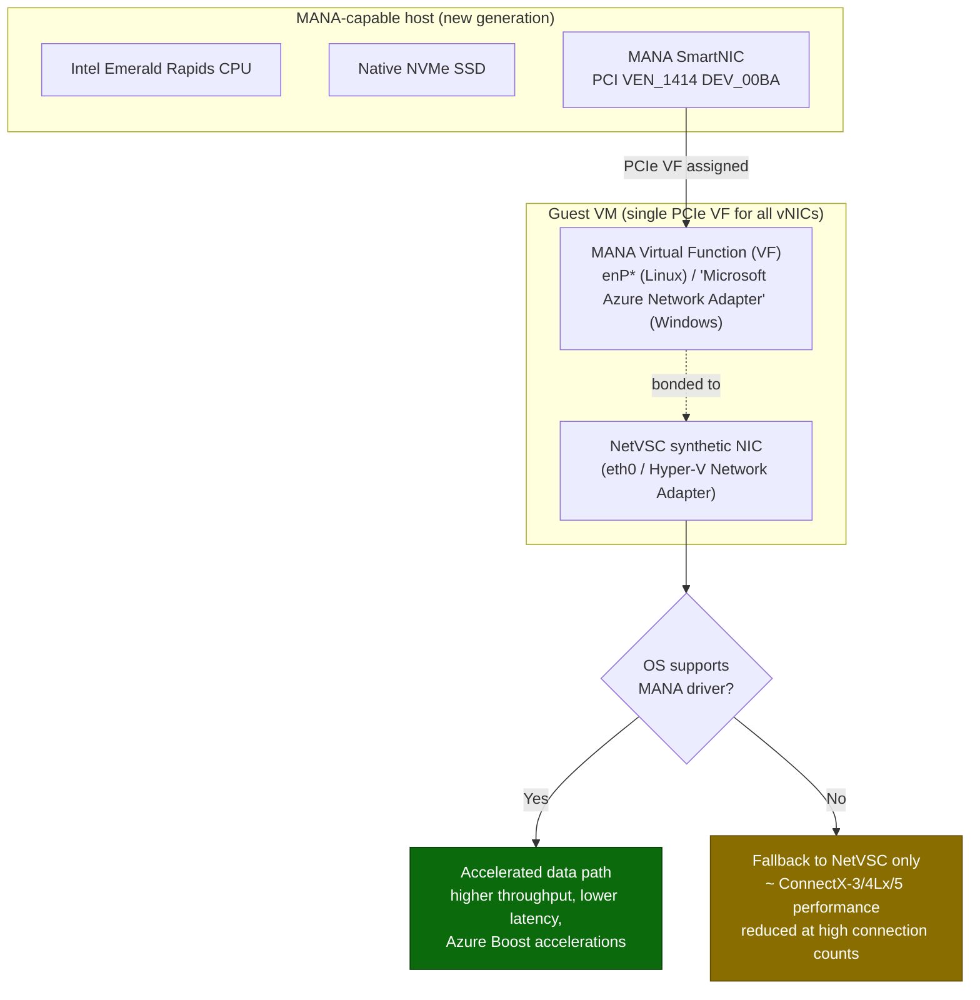

# Microsoft Azure Network Adapter (MANA) on Existing VM SKUs

## Sources
- Announcement: [Announcing MANA support for Existing VM SKUs](https://techcommunity.microsoft.com/blog/AzureInfrastructureBlog/announcing-microsoft-azure-network-adapter-mana-support-for-existing-vm-skus/4493279)
- [MANA support for existing VM sizes](https://learn.microsoft.com/en-us/azure/virtual-network/accelerated-networking-mana-existing-sizes)
- [Windows VMs with MANA](https://learn.microsoft.com/en-us/azure/virtual-network/accelerated-networking-mana-windows)
- [Linux VMs with MANA](https://learn.microsoft.com/en-us/azure/virtual-network/accelerated-networking-mana-linux)
- [NVA opt-out (`LegacyVMNVA`)](https://learn.microsoft.com/en-us/azure/virtual-network/accelerated-networking-mana-network-virtual-appliance-opt-out)

---

## What is happening

Azure is deploying a **new hardware generation** to serve capacity for **existing VM size families**. That hardware
is optimized around three pillars:

- **Intel Emerald Rapids** CPUs
- **Native NVMe SSD** support (higher storage bandwidth, lower latency)
- **Microsoft Azure Network Adapter (MANA)** — the new SmartNIC / network adapter

Because capacity is placed based on regional demand, **existing and newly-created VMs** in eligible families can land
on MANA-capable hardware. Rollout timelines are communicated through **Service Health Advisory** updates. The goal is
to give customers of older SKUs the benefit of new server hardware while they migrate to newer SKUs.

### What you get if your OS fully supports MANA
- Sub-second NIC firmware upgrades
- Higher throughput and lower latency
- Increased security
- Azure Boost-enabled data-path acceleration

### What happens if your OS does *not* support MANA
- Your VM **still has network connectivity** — no outage.
- Networking automatically **falls back to the NetVSC** synthetic adapter.
- The MANA Virtual Function (VF) may be visible, but **no interfaces are exposed** by the MANA driver.
- Performance is **comparable to previous-generation** SR-IOV (Mellanox `ConnectX-3` / `ConnectX-4 Lx` / `ConnectX-5`).
- Workloads with a **high number of concurrent connections** may see reduced performance.

> Networking limits in Azure are tied to the **VM size, not the hardware**. If your OS supports every network device
> Azure uses, no performance change is expected when moving to MANA-capable hardware.

---

## MANA hardware / data-path diagram



**Key hardware behavior:** Even with multiple vNICs configured, MANA exposes **only one PCIe Virtual Function** to the
VM. All VM NICs share that single VF. Because limits are set per VM size, this has no performance effect.

On the wire, each Accelerated-Networking vNIC appears as **two interfaces** inside the guest:
- the **routable synthetic** interface (`eth0` / Hyper-V Network Adapter) served by NetVSC, and
- the **MANA VF** interface (`enP*` on Linux) bonded to it.

---

## Applicable VM series

| Family | Series |
|--------|--------|
| A | Av2\* |
| B | Bsv2 |
| D | Dv1\*, Dsv1\*, Dv2\*, Dsv2\*, Dv3, Dsv3, Dv4, Dsv4, Ddv4, Ddsv4, Dv5, Dsv5, Ddv5, Ddsv5, Dlsv5, Dldsv5, Dpsv6, Dpdsv6, Dplsv6, Dpldsv6 |
| E | Ev3, Esv3, Ev4, Esv4, Edv4, Edsv4, Ev5, Esv5, Edv5, Edsv5, Epsv6, Epdsv6 |
| Eb | Ebsv5, Ebdsv5 |
| F | F\*, Fs\*, Fsv2\* |
| G | G\*, Gs\* |
| L | Ls\* |

\* Series announced for retirement — migrate to a replacement series to avoid capacity limits and forced deallocation.

---

## What you should do

1. **Check OS support** — confirm the VM runs an OS that supports MANA (see Windows / Linux docs). If it does, no
   action needed.
2. **Resize Intel-based workloads if possible** — move to **Intel v6 or later**, which support MANA regardless of OS.
3. **If you can't resize** (e.g., Arm/Cobalt workloads) — **update the OS** to a MANA-supporting build.
   MANA-eligible series can run on both Mellanox (`mlx4`/`mlx5`) and MANA NICs, so keep existing `mlx` support present.
4. **Validate workload behavior** after deployment or resize.

> If Accelerated Networking is **not** enabled on the VM, no action is required — the VM may still land on MANA
> hardware but the workload runs unchanged.

### OS / kernel quick reference
- **Windows:** Look for `Microsoft Azure Network Adapter` in `Get-NetAdapter`. If absent, download drivers from
  <https://aka.ms/manawindowsdrivers>.
- **Linux:** MANA Ethernet drivers landed upstream in **kernel 5.15+**; **6.2+** adds InfiniBand/RDMA and DPDK.
  Kernels 5.15 / 6.1 need backported support.

> **Important — the driver matters more than the check output.** On either OS, the in-guest verification commands
> (`Get-NetAdapter` / `Get-PnpDevice` on Windows, `lspci` / `ip link` / `ethtool` on Linux) can legitimately return
> **empty or "not found"** — for example when the VM currently sits on previous-gen (Mellanox) hardware, or when it is
> on MANA hardware but AccelNet isn't enabled. An empty result does **not** mean the VM is broken or misconfigured.
> What actually matters is that the **MANA driver is present in the OS** so that, whenever the VM does land on
> MANA-capable hardware, it can use the accelerated path instead of falling back to NetVSC. Validate driver presence
> (Windows: the MANA driver package installed; Linux: `mana*.ko` present for your running kernel) rather than relying
> only on whether a given check currently returns a device.

### Just check the driver (device vs. driver — they are different)

The most common confusion: **device checks look for the PCI VF that only appears on MANA hardware; driver checks
look at the OS driver store, which is what you actually control.** On a VM still on Mellanox hardware the device
checks are empty *by design*, yet the driver can already be staged and will bind automatically once the VM lands on
MANA hardware. To verify **only** that the driver is present:

**Linux**
```bash
# MANA driver present (built-in or as a module)?
grep -q 'mana' /lib/modules/$(uname -r)/modules.builtin && echo "MANA built into kernel"
find /lib/modules/$(uname -r)/kernel -name 'mana*.ko*' 2>/dev/null
```
Output present → driver is there (it stays unloaded while on Mellanox — that's normal). Ubuntu 24.04 / 6.11-azure
kernels already carry it built-in plus `mana_ib.ko`.

**Windows**
```powershell
# MANA driver staged in the driver store (present even with no MANA device)
pnputil /enum-drivers | Select-String -Context 0,5 'mana'
Get-WindowsDriver -Online -All |
    Where-Object { $_.OriginalFileName -match 'mana' -or $_.Driver -match 'mana' } |
    Format-Table Driver, OriginalFileName, ProviderName, Version, ClassName
```
Output present → driver installed; binds automatically on MANA hardware. Empty → the image lacks MANA support; use a
MANA-supported Windows image/driver (<https://aka.ms/manawindowsdrivers>).

> `Get-PnpDevice ... DEV_00BA` and `lspci | grep 00ba` check for the **device**, not the driver — that's why they
> come back empty on Mellanox hardware even when the driver is present and the VM is perfectly healthy.

#### How to intentionally land on MANA hardware
A **stop-deallocate + start** re-triggers placement and may move the VM to MANA-capable hardware (a guest reboot will
**not** — it keeps the same host). Success is capacity-dependent per SKU/region and not guaranteed on any single
attempt. The most reliable path is to **resize to a v6 series** (Dsv6/Esv6, etc.), which are MANA-optimized by design.
```bash
az vm deallocate -g <rg> -n <vm> && az vm start -g <rg> -n <vm>   # then re-check: lspci -d 1414:
```

---

## Network Virtual Appliances (NVAs) — special case

NVAs depend directly on the underlying NIC/driver, so they are uniquely impacted.

- Confirm your NVA vendor **explicitly supports MANA**, and/or run on a compatible VM series + OS.
- Use the **`LegacyVMNVA`** tag (applied via **Azure Policy** definition `e87a87f5-e6dd-4919-be21-abb0a4ea4630`) to
  **temporarily avoid** MANA placement for the **NVA or VM** (and VM Scale Sets) while migrating.
  - If applied/enabled before **May 31, 2027**, the VM won't be placed on MANA hardware until that date.
  - After **May 31, 2027**, the tag is **no longer honored**.
- Recommended tagging deadlines (align with earliest placement):
  - MANA-eligible **Cobalt 100 & Intel v5** VMs (Public cloud): **May 26, 2026**
  - MANA-eligible **Intel v1–v4** VMs (Public cloud): **August 1, 2026**
- To enable the tag on existing resources, run a **reapply** (see the AZ CLI script).
- **Caveats:** using `LegacyVMNVA` with an **ODCR** reduces the capacity pool and **voids ODCR SLA** for those VMs;
  NVAs bought outside Marketplace or via managed service require coordination with the provider.

---

## FAQ highlights
- **When can my VM land on MANA?** After a **stop-deallocate + start**, or during a **standard maintenance event**; new
  VMs in eligible series are also eligible.
- **AKS impacted?** No.
- **VNet encryption impacted?** No.
- **DPDK impacted?** Yes — update DPDK apps to meet minimum MANA requirements.
