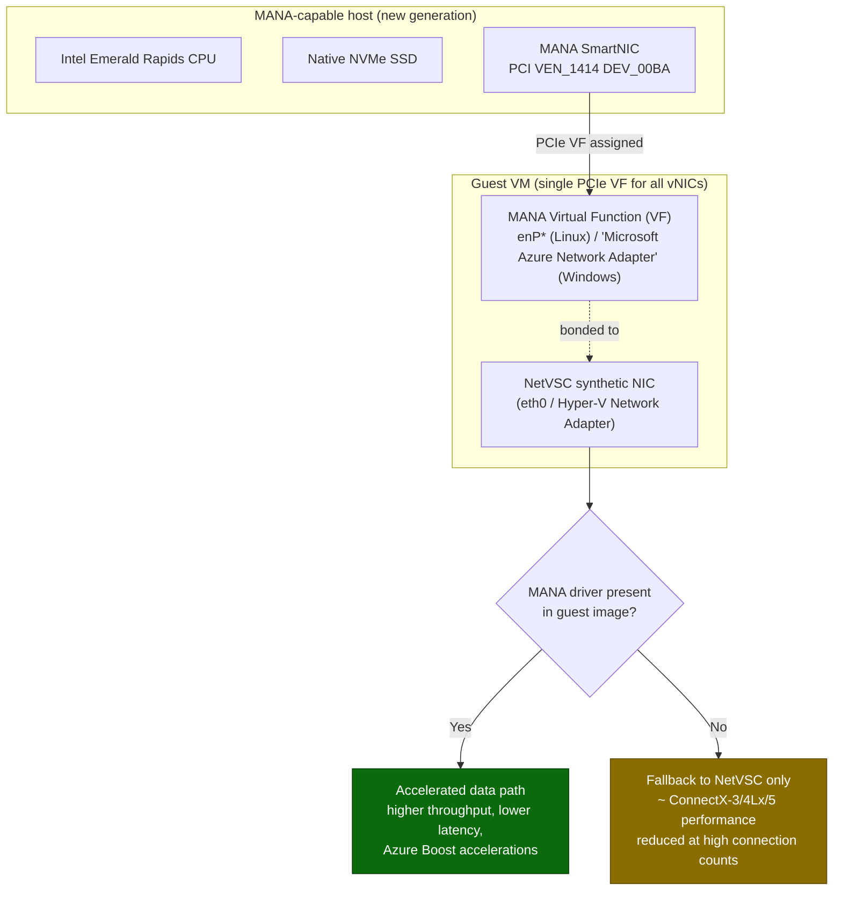

# Microsoft Azure Network Adapter (MANA) on Existing VM SKUs

> **New to the concepts?** Read
> [How Accelerated Networking, VFs, Mellanox, and MANA actually work](./MANA-AccelNet-VF-Primer.md) first. It explains
> Virtual Functions, the synthetic/NetVSC interface, and why "AccelNet is enabled" does not mean "MANA ready."

## Sources
- Announcement: [Announcing MANA support for Existing VM SKUs](https://techcommunity.microsoft.com/blog/AzureInfrastructureBlog/announcing-microsoft-azure-network-adapter-mana-support-for-existing-vm-skus/4493279)
- [MANA support for existing VM sizes](https://learn.microsoft.com/en-us/azure/virtual-network/accelerated-networking-mana-existing-sizes)
- [Windows VMs with MANA](https://learn.microsoft.com/en-us/azure/virtual-network/accelerated-networking-mana-windows)
- [Linux VMs with MANA](https://learn.microsoft.com/en-us/azure/virtual-network/accelerated-networking-mana-linux)
- [NVA opt-out (`LegacyVMNVA`)](https://learn.microsoft.com/en-us/azure/virtual-network/accelerated-networking-mana-network-virtual-appliance-opt-out)

> Compiled from publicly available Microsoft documentation; a personal reference, not an official Microsoft
> communication. MANA enablement schedules are communicated per-subscription through **Azure Service Health** — check
> your own advisory for your regions and subscriptions.

---

## What is happening

Azure is deploying a **new hardware generation** to serve capacity for **existing VM size families**. That hardware
is optimized around three pillars:

- **Intel Emerald Rapids** CPUs
- **Native NVMe SSD** support (higher storage bandwidth, lower latency)
- **Microsoft Azure Network Adapter (MANA)** — the new SmartNIC / network adapter

Because capacity is placed based on regional demand, **existing and newly-created VMs** in eligible families can land
on MANA-capable hardware. Rollout timelines are communicated through **Service Health Advisory** updates. The goal is
to give customers of older SKUs the benefit of new server hardware while they migrate to newer SKUs.

### What you get if your OS fully supports MANA
- Sub-second NIC firmware upgrades
- Higher throughput and lower latency
- Increased security
- Azure Boost-enabled data-path acceleration

### What happens if your OS does *not* support MANA
- Your VM **still has network connectivity** — no outage.
- Networking automatically **falls back to the NetVSC** synthetic adapter.
- The MANA Virtual Function (VF) may be visible, but **no interfaces are exposed** by the MANA driver.
- Performance is **comparable to previous-generation** SR-IOV (Mellanox `ConnectX-3` / `ConnectX-4 Lx` / `ConnectX-5`).
- Workloads with a **high number of concurrent connections** may see reduced performance.

> Networking limits in Azure are tied to the **VM size, not the hardware**. If your OS supports every network device
> Azure uses, no performance change is expected when moving to MANA-capable hardware.

---

## MANA hardware / data-path diagram


```mermaid
flowchart TB
    subgraph HW["MANA-capable host (new generation)"]
        direction TB
        CPU["Intel Emerald Rapids CPU"]
        NVMe["Native NVMe SSD"]
        MANA["MANA SmartNIC<br/>PCI VEN_1414 DEV_00BA"]
    end

    subgraph VM["Guest VM (single PCIe VF for all vNICs)"]
        direction TB
        NetVSC["NetVSC synthetic NIC<br/>(eth0 / Hyper-V Network Adapter)"]
        VF["MANA Virtual Function (VF)<br/>enP* (Linux) / 'Microsoft Azure Network Adapter' (Windows)"]
    end

    MANA -->|PCIe VF assigned| VF
    VF -. bonded to .-> NetVSC

    NetVSC --> D{MANA driver present<br/>in guest image?}
    D -->|Yes| FAST["Accelerated data path<br/>higher throughput, lower latency,<br/>Azure Boost accelerations"]
    D -->|No| FALL["Fallback to NetVSC only<br/>~ ConnectX-3/4Lx/5 performance<br/>reduced at high connection counts"]

    classDef good fill:#0b6a0b,color:#fff,stroke:#083d08;
    classDef warn fill:#8a6d00,color:#fff,stroke:#5c4900;
    class FAST good;
    class FALL warn;
```

**Key hardware behavior:** Even with multiple vNICs configured, MANA exposes **only one PCIe Virtual Function** to the
VM. All VM NICs share that single VF. Because limits are set per VM size, this has no performance effect.

On the wire, each Accelerated-Networking vNIC appears as **two interfaces** inside the guest:
- the **routable synthetic** interface (`eth0` / Hyper-V Network Adapter) served by NetVSC, and
- the **MANA VF** interface (`enP*` on Linux) bonded to it.

---

## Points commonly misunderstood

These are the questions that come up most often. Each answer is stated positively — no interpretation of any
individual notification required.

| Question | Answer |
|---|---|
| Does having Accelerated Networking enabled mean I'm ready? | **No.** AccelNet enabled is the condition that *triggers* verification, not an exemption from it. A VM can run AccelNet today over the Mellanox path with no MANA driver present. Only **AccelNet not enabled** is a genuine no-action state. |
| Is running a supported OS version enough? | **No.** A supported OS *version* and the driver actually being *installed in your image* are different things — see [Supported OS ≠ driver installed](#supported-os--driver-installed--the-most-common-misread). |
| Which series are eligible when? | The **v5 / Cobalt 100** series are already eligible in all public regions. The **v1–v4** series become eligible on a phased regional schedule — check your own Service Health advisory for your regions rather than relying on any date reproduced here. |
| When must the `LegacyVMNVA` tag be in place? | Two distinct deadlines. The tag protects a VM only if active **before that VM is placed** on MANA hardware; separately, the tag stops being honored **for everyone** on 31 May 2027. |
| Will my running VMs be migrated? | **No.** Placement is re-evaluated only on VM create, redeploy, stop-deallocate + start, or a platform maintenance event. |

---

## Applicable VM series

| Family | Series |
|--------|--------|
| A | Av2\* |
| B | Bsv2 |
| D | Dv1\*, Dsv1\*, Dv2\*, Dsv2\*, Dv3, Dsv3, Dv4, Dsv4, Ddv4, Ddsv4, Dv5, Dsv5, Ddv5, Ddsv5, Dlsv5, Dldsv5, Dpsv6, Dpdsv6, Dplsv6, Dpldsv6 |
| E | Ev3, Esv3, Ev4, Esv4, Edv4, Edsv4, Ev5, Esv5, Edv5, Edsv5, Epsv6, Epdsv6 |
| Eb | Ebsv5, Ebdsv5 |
| F | F\*, Fs\*, Fsv2\* |
| G | G\*, Gs\* |
| L | Ls\* |

\* Series announced for retirement — migrate to a replacement series to avoid capacity limits and forced deallocation.

---

## What you should do

1. **Check that the MANA driver is present** — see Windows / Linux docs. Confirm the driver is actually installed in
   the image, **not** just that the OS version is one that supports MANA. Those are different things (see
   [Supported OS ≠ driver installed](#supported-os--driver-installed--the-most-common-misread) below).
2. **Resize Intel-based workloads if possible** — move to **Intel v6 or later**, which support MANA regardless of OS.
3. **If you can't resize** (e.g., Arm/Cobalt workloads) — **update the OS** to a MANA-supporting build.
   MANA-eligible series can run on both Mellanox (`mlx4`/`mlx5`) and MANA NICs, so keep existing `mlx` support present.
4. **Validate workload behavior** after deployment or resize.

> If Accelerated Networking is **not** enabled on the VM, no action is required — the VM may still land on MANA
> hardware but the workload runs unchanged.
>
> If Accelerated Networking **is** enabled, that is the condition that *triggers* the need to verify — it is not a
> sign the VM is ready. A VM can have AccelNet enabled today over the Mellanox path and still have no MANA driver.

### Supported OS ≠ driver installed — the most common misread

Three separate things get conflated when people assess readiness. Passing one does not imply passing the next:

| # | Layer | What it actually means | How to check |
|---|-------|------------------------|--------------|
| 1 | **AccelNet enabled** | The VM uses SR-IOV at all. If off, MANA does not affect the data path. | `enableAcceleratedNetworking` on the NIC |
| 2 | **OS version supports MANA** | The distro/build has MANA support upstream. | Linux kernel 5.15+ (6.2+ for RDMA/DPDK); MANA-capable Windows image |
| 3 | **MANA driver present in *this* image** | The driver is staged in the image you are actually running. | `mana*.ko` for the running kernel / `pnputil /enum-drivers` |

The gap that bites people is **2 → 3**. Custom images, hardened golden images, and third-party NVA appliance images
routinely satisfy #2 while failing #3. "I'm running a supported OS, so I'm fine" is not a valid conclusion.

This is compounded by the fact that while the VM is still on Mellanox hardware, the in-guest **device** checks return
empty *whether or not* the driver is installed — so there is no local signal that anything is wrong until placement
changes and the workload is already degraded. Check the **driver store**, not the device.

### Readiness decision matrix

| Accelerated Networking | MANA driver / vendor support | Action |
|---|---|---|
| Off | n/a | **None.** MANA does not affect the effective data path. |
| On | Confirmed present | **None.** VM uses the accelerated MANA path once placed. |
| On | Missing or unknown | **Verify, then remediate.** Connectivity is retained via NetVSC, but the accelerated VF is not used — expect degraded performance for NVA and high-connection workloads. Apply `LegacyVMNVA` as a temporary hold while you remediate. |
| On | NVA appliance, vendor support unknown | **Confirm with the vendor.** Hold with `LegacyVMNVA` until confirmed. |

### Find affected VMs across the tenant

Per-VM checks don't scale for a first pass. This Resource Graph query lists every VM in an eligible series with its
Accelerated Networking state, so you can scope remediation before touching individual guests:

```kusto
Resources
| where type =~ 'microsoft.compute/virtualmachines'
| extend vmSize = tostring(properties.hardwareProfile.vmSize)
| where vmSize matches regex @'(?i)^Standard_(A|B|D|E|F|G|L)'
| mv-expand nic = properties.networkProfile.networkInterfaces
| extend nicId = tostring(nic.id)
| join kind=leftouter (
    Resources
    | where type =~ 'microsoft.network/networkinterfaces'
    | project nicId = id, accelNet = tobool(properties.enableAcceleratedNetworking)
) on nicId
| project subscriptionId, resourceGroup, name, vmSize, accelNet,
          legacyTag = tostring(tags['LegacyVMNVA'])
| order by accelNet desc, vmSize asc
```

Rows with `accelNet == true` are the population that needs driver verification. `accelNet == false` needs no action.
Narrow the `matches regex` filter to your specific series list as needed.

> The query answers **layer 1 only** (see the table above). It cannot see inside the guest — a VM showing
> `accelNet == true` still requires an in-guest driver check before you can call it ready.

### OS / kernel quick reference
- **Windows:** Look for `Microsoft Azure Network Adapter` in `Get-NetAdapter`. If absent, download drivers from
  <https://aka.ms/manawindowsdrivers>.
- **Linux:** MANA Ethernet drivers landed upstream in **kernel 5.15+**; **6.2+** adds InfiniBand/RDMA and DPDK.
  Kernels 5.15 / 6.1 need backported support.

> **Important — the driver matters more than the check output.** On either OS, the in-guest verification commands
> (`Get-NetAdapter` / `Get-PnpDevice` on Windows, `lspci` / `ip link` / `ethtool` on Linux) can legitimately return
> **empty or "not found"** — for example when the VM currently sits on previous-gen (Mellanox) hardware, or when it is
> on MANA hardware but AccelNet isn't enabled. An empty result does **not** mean the VM is broken or misconfigured.
> What actually matters is that the **MANA driver is present in the OS** so that, whenever the VM does land on
> MANA-capable hardware, it can use the accelerated path instead of falling back to NetVSC. Validate driver presence
> (Windows: the MANA driver package installed; Linux: `mana*.ko` present for your running kernel) rather than relying
> only on whether a given check currently returns a device.

### Just check the driver (device vs. driver — they are different)

The most common confusion: **device checks look for the PCI VF that only appears on MANA hardware; driver checks
look at the OS driver store, which is what you actually control.** On a VM still on Mellanox hardware the device
checks are empty *by design*, yet the driver can already be staged and will bind automatically once the VM lands on
MANA hardware. To verify **only** that the driver is present:

**Linux**
```bash
# MANA driver present (built-in or as a module)?
grep -q 'mana' /lib/modules/$(uname -r)/modules.builtin && echo "MANA built into kernel"
find /lib/modules/$(uname -r)/kernel -name 'mana*.ko*' 2>/dev/null
```
Output present → driver is there (it stays unloaded while on Mellanox — that's normal). Ubuntu 24.04 / 6.11-azure
kernels already carry it built-in plus `mana_ib.ko`.

**Windows**
```powershell
# MANA driver staged in the driver store (present even with no MANA device)
pnputil /enum-drivers | Select-String -Context 0,5 'mana'
Get-WindowsDriver -Online -All |
    Where-Object { $_.OriginalFileName -match 'mana' -or $_.Driver -match 'mana' } |
    Format-Table Driver, OriginalFileName, ProviderName, Version, ClassName
```
Output present → driver installed; binds automatically on MANA hardware. Empty → the image lacks MANA support; use a
MANA-supported Windows image/driver (<https://aka.ms/manawindowsdrivers>).

> `Get-PnpDevice ... DEV_00BA` and `lspci | grep 00ba` check for the **device**, not the driver — that's why they
> come back empty on Mellanox hardware even when the driver is present and the VM is perfectly healthy.

#### How to intentionally land on MANA hardware
A **stop-deallocate + start** re-triggers placement and may move the VM to MANA-capable hardware (a guest reboot will
**not** — it keeps the same host). Success is capacity-dependent per SKU/region and not guaranteed on any single
attempt. The most reliable path is to **resize to a v6 series** (Dsv6/Esv6, etc.), which are MANA-optimized by design.
```bash
az vm deallocate -g <rg> -n <vm> && az vm start -g <rg> -n <vm>   # then re-check: lspci -d 1414:
```

---

## Network Virtual Appliances (NVAs) — special case

NVAs depend directly on the underlying NIC/driver, so they are uniquely impacted.

- Confirm your NVA vendor **explicitly supports MANA**, and/or run on a compatible VM series + OS.
- Use the **`LegacyVMNVA`** tag (applied via **Azure Policy** definition `e87a87f5-e6dd-4919-be21-abb0a4ea4630`) to
  **temporarily avoid** MANA placement for the **NVA or VM** (and VM Scale Sets) while migrating.
  - **Two separate deadlines — don't conflate them:**
    - The tag protects a given VM only if it is applied **and activated before that VM is placed** on MANA-capable
      hardware, i.e. before MANA enablement reaches your region. Applying it afterward does **not** move an
      already-placed VM back.
    - **May 31, 2027** is when the tag stops being honored **for everyone**. Complete OS / product remediation before
      that date.
  - Tagging alone is not enough — see the `reapply` note below for how to activate it.
- **Tag early.** Because the tag only protects a VM that has not yet been placed on MANA hardware, apply it **before
  MANA enablement reaches your region**. Regional enablement timing is communicated per-subscription through
  **Azure Service Health** — check your own advisory for your regions.
- To enable the tag on existing resources, run a **reapply** (see the AZ CLI script).

> **Important — use `reapply` to activate the tag, not deallocate/start.** Once the `LegacyVMNVA` tag has been placed
> on the VM/VMSS, the **preferred** way to make Azure honor it (move the VM off MANA-eligible placement) is a
> **`reapply`** operation — `az vm reapply` for a standalone VM or VMSS Flex instance, or the VMSS Uniform `reapply`
> REST call. `reapply` re-evaluates placement **without downtime**. A **stop-deallocate + start** should be treated as
> a **last resort**, only if `reapply` doesn't take effect, because it incurs downtime and a full re-placement.
- **Caveats:** NVAs bought outside Marketplace or via managed service require coordination with the provider. The
  opt-out is **not available for VMs using a custom OS image**. If your VMs run under an **on-demand capacity
  reservation (ODCR)**, review the capacity and SLA implications with your Microsoft account team before applying the
  tag — see the
  [opt-out documentation](https://learn.microsoft.com/en-us/azure/virtual-network/accelerated-networking-mana-network-virtual-appliance-opt-out).

---

## FAQ highlights
- **When can my VM land on MANA?** After a **stop-deallocate + start**, or during a **standard maintenance event**; new
  VMs in eligible series are also eligible.
- **AKS impacted?** No.
- **VNet encryption impacted?** No.
- **DPDK impacted?** Yes — update DPDK apps to meet minimum MANA requirements.
