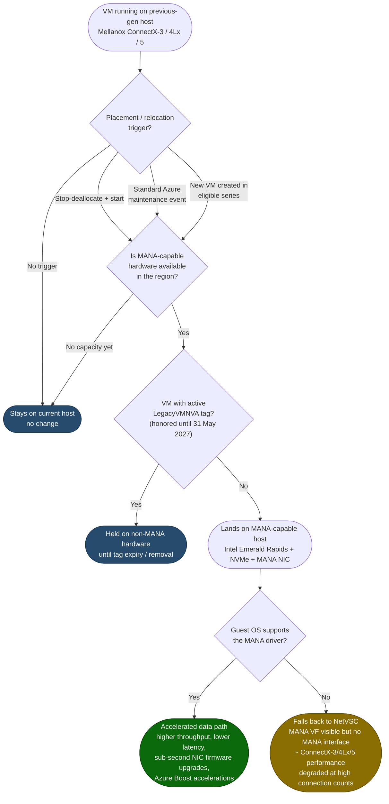
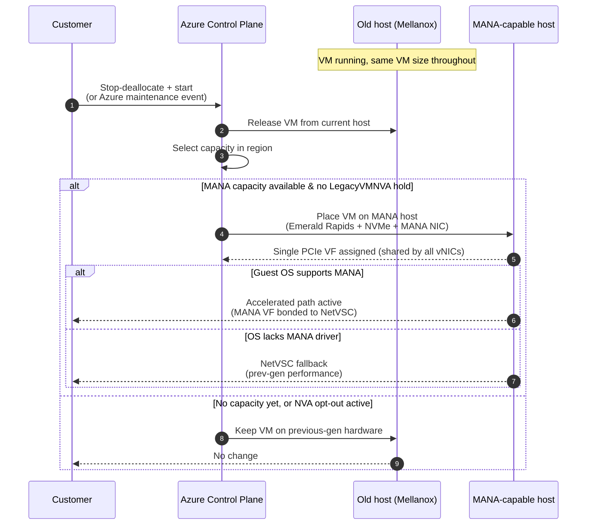

# How a VM Moves from Old Hardware to New MANA Hardware

> Public sources only (Azure Infrastructure Blog + Microsoft Learn). Networking limits are tied to the **VM size,
> not the hardware** — the VM size stays the same; only the underlying host generation changes.

## 1. Placement flow — what triggers the move and what happens next

## 2. Lifecycle sequence — the move step by step

## Notes
- The VM **size/SKU does not change** — only the physical host generation. Networking limits follow the VM size.
- Multiple vNICs still receive **one shared PCIe Virtual Function** on MANA hardware.
- **No outage** either way: unsupported OSes keep connectivity via the NetVSC synthetic adapter.
- **NVAs or VMs** can pin to non-MANA hardware with the **`LegacyVMNVA`** tag until **31 May 2027**, after which it is no
  longer honored.
