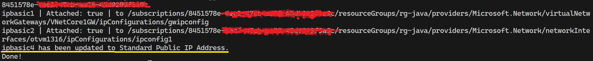

# Upgrade Basic IP address to Standard IP address in Azure using Java SDK

The IPs need to be attached by any other resource in Azure, so we need to detach the IP from the resource and then upgrade the IP to Standard SKU and then attach the IP to the resource again. (depends on the resource type).

## Prerequisites

Azure Java SDK should be installed and configured.
A service principal should be created and configured with the required permissions.

[Upgrading a basic public IP address to Standard SKU - Guidance](https://learn.microsoft.com/en-us/azure/virtual-network/ip-services/public-ip-basic-upgrade-guidance)

Basic SKU vs Standard SKU:

| --- | Standard SKU public IP | Basic SKU public IP |
| --- | --- | --- |
| Allocation method | Static | IPv4: Static or dynamic |
| Security | Secure by default model and be closed <br /> to inbound traffic when used as a frontend.<br />Allow traffic with network security group is required | Open by default |
| Availability zones | Yes | Not supported |
| Routing preference | Yes | Not supported |

Sample Java code to upgrade the IP address from Basic to Standard see in the folder [/src/main/java/io/otmigrationpip/Main.java](/src/main/java/io/otmigrationpip/Main.java)

```java
azureResourceManager.networks().manager().serviceClient().getPublicIpAddresses()
                            .createOrUpdate(p1.resourceGroupName(), p1.name(), new PublicIpAddressInner().withLocation(p1.regionName())
                            .withSku(new PublicIpAddressSku().withName(PublicIpAddressSkuName.STANDARD))
                            .withPublicIpAllocationMethod(IpAllocationMethod.STATIC),                        
                            com.azure.core.util.Context.NONE);
```

Result: 