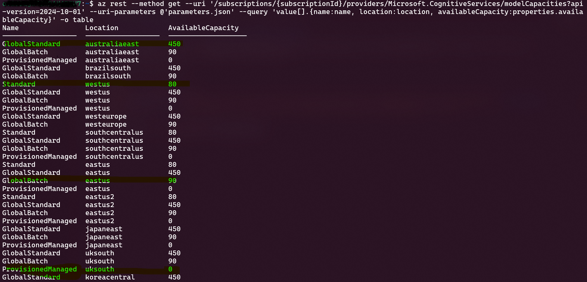
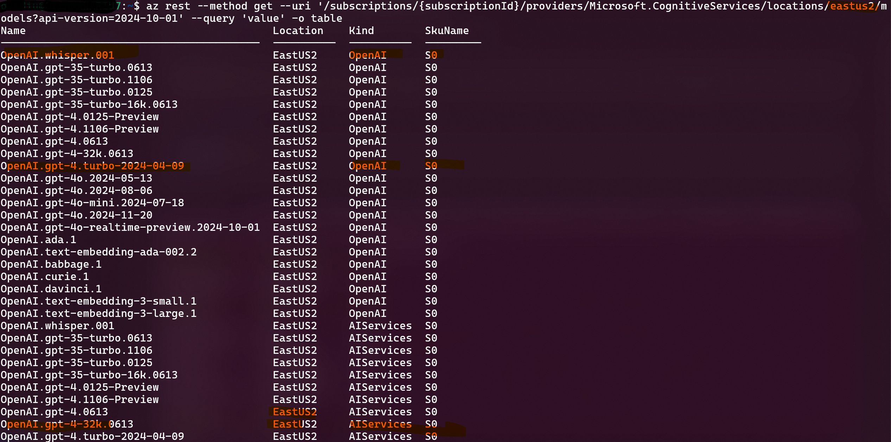

# Azure AI Model Capacities

## Find the right OpenAI PTU capacity and Model availability by region

In these samples will use [az rest](https://learn.microsoft.com/en-us/cli/azure/use-azure-cli-rest-command?tabs=bash) CLI command to quickly find out capacity and models for specific subscription login using az cli.

Sample 1 find right capacity

```bash
az login -t 'tenantid'
az account set -s 'subscriptionid'
az rest --method get --uri '/subscriptions/{subscriptionId}/providers/Microsoft.CognitiveServices/modelCapacities?api-version=2024-10-01' --uri-parameters @parameters.json --query 'value[].{name:name, location:location, availableCapacity:properties.availableCapacity}' -o table
```

Sample parameter file [parameters.json](./parameters.json)

```json
{
    "modelFormat": "OpenAI",
    "modelName": "gpt-4",
    "modelVersion": "turbo-2024-04-09"
}
```

Output for above sample:



---

Sample 2 find the models in region

```bash
az login -t 'tenantid'
az account set -s 'subscriptionid'
location='eastus2'
az rest --method get --uri "/subscriptions/{subscriptionId}/providers/Microsoft.CognitiveServices/locations/$location
/models?api-version=2024-10-01" --query 'value' -o table
```

Output for above sample:



For filter only OpenAI models

```bash
az login -t 'tenantid'
az account set -s 'subscriptionid'
location='eastus2'
az rest --method get --uri "/subscriptions/{subscriptionId}/providers/Microsoft.CognitiveServices/locations/$location/models?api-version=2024-10-01" --query "value[?kind == 'OpenAI']" -o table
```
