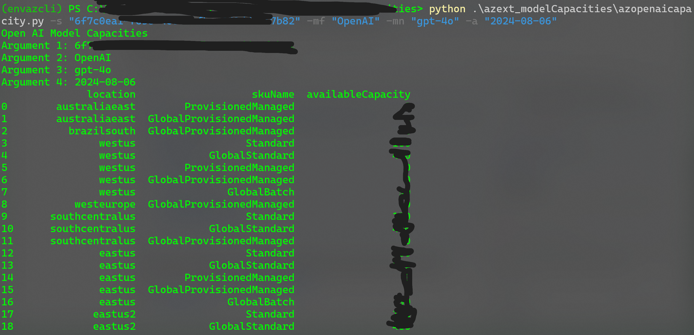

# Azure Model Capacities

This document provides information on how to list model capacities using the Azure REST API.

## API Endpoint

```
GET https://management.azure.com/subscriptions/{subscription_id}/providers/Microsoft.CognitiveServices/modelCapacities?api-version=2024-04-01-preview&modelFormat={model_format}&modelName={model_name}&modelVersion={model_version}
```

## URI Parameters

| Parameter       | Description                                                                 |
|-----------------|-----------------------------------------------------------------------------|
| subscription_id | The subscription ID for the Azure account.                                  |
| model_format    | The format of the model (e.g., `OpenAI`).                       |
| model_name      | The name of the model.                                                      |
| model_version   | The version of the model.                                                   |

## Sample Request

```http
GET https://management.azure.com/subscriptions/00000000-0000-0000-0000-000000000000/providers/Microsoft.CognitiveServices/modelCapacities?api-version=2024-10-01&modelFormat=OpenAI&modelName=ada&modelVersion=1
```

## Response

A successful response returns the model capacities.

```json
{
  "value": [
    {
      "id": "/subscriptions/{subscriptionContext.SubscriptionId}/providers/Microsoft.CognitiveServices/locations/WestUS/models/OpenAI.ada.1/skuCapacities/Standard",
      "type": "Microsoft.CognitiveServices/locations/models/skuCapacities",
      "name": "Standard",
      "location": "WestUS",
      "properties": {
        "model": {
          "format": "OpenAI",
          "name": "ada",
          "version": "1"
        },
        "skuName": "Standard",
        "availableCapacity": 300,
        "availableFinetuneCapacity": 20
      }
    }
  ]
}
```

For more details, refer to the [Azure REST API documentation](https://learn.microsoft.com/en-us/rest/api/aiservices/accountmanagement/model-capacities/list?view=rest-aiservices-accountmanagement-2024-10-01&tabs=HTTP).

Sample
[azopenaicapacity.py](azopenaicapacity.py)

