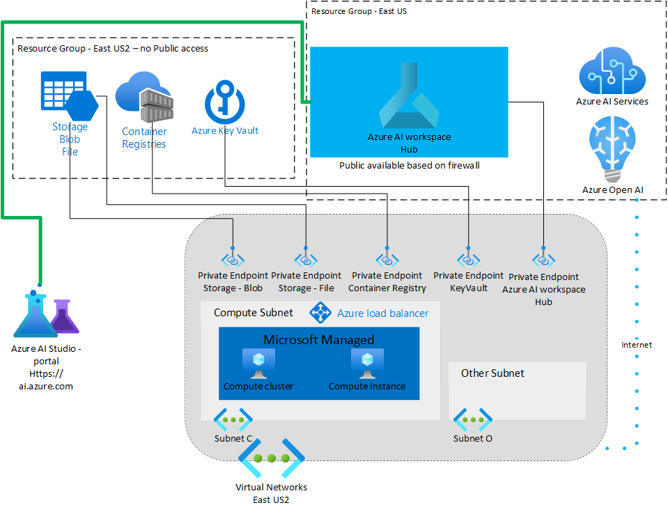

# Azure AI Services

## Sandbox

In this section, we will explore the Azure AI services in special if you are a beginner and we want to learn about and you need a sandbox to play with.

Here's steps for building a sandbox for Azure AI services.

- Create an Azure Virtual Network (VNet) to secure communications between services in the virtual network. (no need to be connected to Adobe network - or peer with other networks)
= Create an Azure Storage Account (blob and file) behind the VNet. This service is used as default storage for the workspace.
- Create an Azure Key Vault behind the VNet. This service is used to store secrets used by the workspace. For example, the security information needed to access the storage account.
- Create an Azure Container Registry (ACR). This service is used as a repository for Docker images. Docker images provide the compute environments needed when training a machine learning model or deploying a trained model as an endpoint.
- Create an Azure AI Service
- Create an Azure AI workspace Hub
- Configure Azure AI workspace Hub to work behind a firewall (just IP whitelisted).
- Connect to the Azure AI studio from Adobe workstation which has the IP allow.

[How to configure a managed network for Azure AI - Azure AI Studio | Microsoft Learn](https://learn.microsoft.com/en-us/azure/ai-studio/how-to/configure-managed-network?tabs=azure-cli)

[Configure a private endpoint for an Azure Machine Learning workspace - Azure Machine Learning | Microsoft Docs](https://docs.microsoft.com/en-us/azure/machine-learning/how-to-configure-private-endpoint)